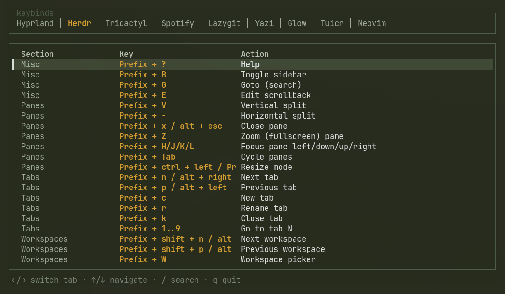

# kb

A small terminal UI for looking up keybindings across the tools you actually
use — one tab per app, opens on the tab matching whatever's currently in
focus, free-text search across all of them.


[](https://github.com/harbefas/keybinds-tui/actions/workflows/ci.yml)



## Why

Keybindings live scattered across config files, plugin docs, and muscle
memory. `kb` puts them in one place: a fast TUI you bind to a shortcut,
that already knows what you were doing when you opened it.

## Features

- **Tabs per app** — one per tool, switch with `←/→` or `Tab`/`Shift+Tab`
- **Auto-focus detection** — guesses which app you were just in (via
  Hyprland window class + process tree) and opens directly on that tab
- **Search** — `/` filters keys and actions in the active tab; multiple
  words match in any order, so "tab next" and "next tab" both find a row
  whose action is "Next tab"
- **Live sourcing where possible** — some tabs are parsed straight from the
  app's real config/state instead of a hand-maintained list (see below)
- **Light/dark theme**, auto-switched by time of day

## Supported apps

| App | Source |
|---|---|
| Hyprland | live — parses `bind`/`bindd`/`bindm` lines from `~/.config/hypr/*.conf` |
| Neovim | live — headless `nvim` dump of `vim.api.nvim_get_keymap()`, loaded in the background |
| Herdr | static defaults + live overrides read from `~/.config/herdr/config.toml` |
| Tridactyl | static (config lives in browser sync storage, no local file to read) |
| Spotify (spotify_player) | static (no local keymap override found) |
| Lazygit | static (no local keymap override found) |
| Yazi | static (defaults are compiled into the binary) |
| Glow | static |
| Tuicr | static |

"Static" tabs are hand-copied from each tool's documented defaults — swap
them for a live source in `src/sources/` if the app you use has one and you
want it parsed instead.

## Build

```sh
cargo build --release
```

Binary lands at `target/release/kb`.

## Usage

Run `kb` in a terminal, or bind it to a key. On launch it tries to guess
which app tab to open based on the window you were just in.

| Key | Action |
|---|---|
| `h`/`←` / `l`/`→` / `Tab` | Switch tabs |
| `j`/`↓` / `k`/`↑` | Move selection |
| `Ctrl+d` / `Ctrl+u` | Half page down / up |
| `gg` / `G` | Jump to top / bottom of the list |
| `/` | Search / filter |
| `Esc` | Cancel search |
| `q` / `Esc` (outside search) | Quit |

### Focus detection

`kb` reads `hyprctl activewindow -j` at startup to guess the tab. If you
launch it from a wrapper script that opens `kb` in its own window (e.g. a
scratchpad terminal), that lookup would just see `kb`'s own window instead —
pass the previously-focused window down explicitly instead:

```sh
KB_FOCUS_CLASS=<class> KB_FOCUS_PID=<pid> kb
```

An example Hyprland scratchpad launcher is not included here since it's
specific to each setup, but the pattern is: capture
`hyprctl activewindow -j` *before* opening `kb`'s window, then pass those
two values through the env vars above.

Everything else (window-class matching, process-tree walking for terminal
apps) works standalone with no extra setup.

## Adding an app

**Without forking**, drop a `~/.config/kb/tabs.toml` and it's merged in at
startup:

```toml
[[tab]]
app = "MyApp"
window_class = ["myapp"]

[[tab.section]]
name = "General"

[[tab.section.bind]]
keys = "Ctrl+X"
action = "Do something"
```

**In the source tree**, each built-in lives in `src/sources/<app>.rs` and
returns a `model::Tab`. Add a live parser if the app has a config/dump you
can read; otherwise a static table following the existing modules (e.g.
`tridactyl.rs`, built via `Tab::from_raw`) works fine. Wire it into the
`tabs` vec in `main.rs` and, if it can run inside a generic terminal window,
add its process name to `focus.rs`.

## Development

```sh
cargo test    # unit tests for the Hyprland and Herdr config parsers
cargo clippy --all-targets -- -D warnings
```

CI runs both on every push/PR.
